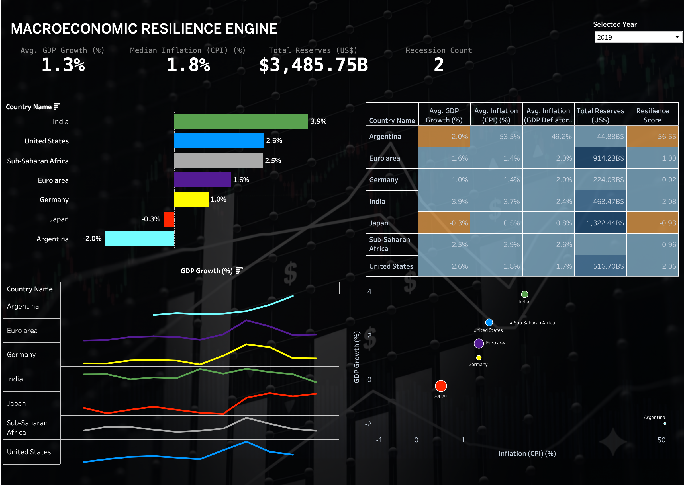
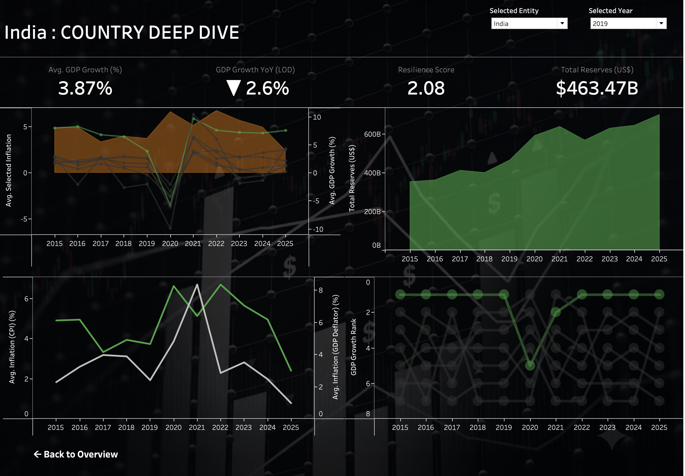

# Macroeconomic Resilience Engine 🌍📈

## Project Overview
An interactive, parameter-driven Tableau application designed to evaluate the economic stability of major global economies between 2015 and 2025. This project translates raw macroeconomic indicators into pre-attentive visual insights, allowing analysts to quickly identify stagflation risks and structural economic shifts.

**[View the Live Interactive Dashboard on Tableau Public](https://public.tableau.com/app/profile/arya.patil6423/viz/MacroeconomicsResilienceEngine/Dashboard1)**

## 📸 Dashboard Gallery

### 1. Global Overview (Macro Trends & Correlation)

*   **Global KPI Banner:** Tracks average GDP, CPI, Total Reserves, and features a dynamic **Recession Count** flagging countries currently in economic contraction.
*   **Sparkline:** Tracks average global inflation over a decade.
*   **Correlation Engine:** Scatter plot analyzing the relationship between Consumer Inflation (CPI) and GDP Growth to identify stagflation clusters.

### 2. Country Deep Dive (Micro-Analysis)

*   **Dynamic Navigation:** Parameter Actions allow users to click any entity on the overview page to instantly load a filtered deep-dive profile.
*   **Resilience Score:** A custom-engineered composite metric `((GDP * 1.5) - CPI)` utilizing a custom diverging color scale to instantly quantify economic stability.
*   **Dual-Axis Focus Trend:** Contrasts local inflation spikes against local economic growth.
*   **Bump Chart Ranking:** Tracks shifting global economic dominance over time using custom Z-order highlighting.

## 🛠️ Technical Arsenal
*   **Advanced Calculations:** Fixed Level of Detail (LOD) expressions for Year-over-Year (YoY) variance independent of visual filters.
*   **Interactivity:** Parameter Actions, custom navigation buttons, and synchronized floating containers.
*   **UI/UX Design:** Dark-theme "Glass UI", pre-attentive color formatting, hidden axis redundancy, and custom tooltip formatting.
*   **Data Pipeline (ETL):** Extracted, cleaned, and modeled raw indicator data from the World Bank.

## 🗄️ Data Dictionary
*   **GDP Growth (%):** Annual percentage growth rate of Gross Domestic Product.
*   **Inflation (CPI):** Consumer Price Index reflecting the cost of living.
*   **GDP Deflator:** Broad measure of inflation across all domestically produced goods and services.
*   **Total Reserves:** Central bank holdings of foreign currencies and gold.

## 🚀 How to Run Locally
1. Clone this repository: `git clone https://github.com/aryapatil7089/Macroeconomic-Resilience-Engine.git`
2. Download the `cleaned_world_bank_data.csv` file and the `macroeconomics.twbx` file.
3. Open `macroeconomics.twbx` using Tableau Desktop or the free Tableau Reader.
